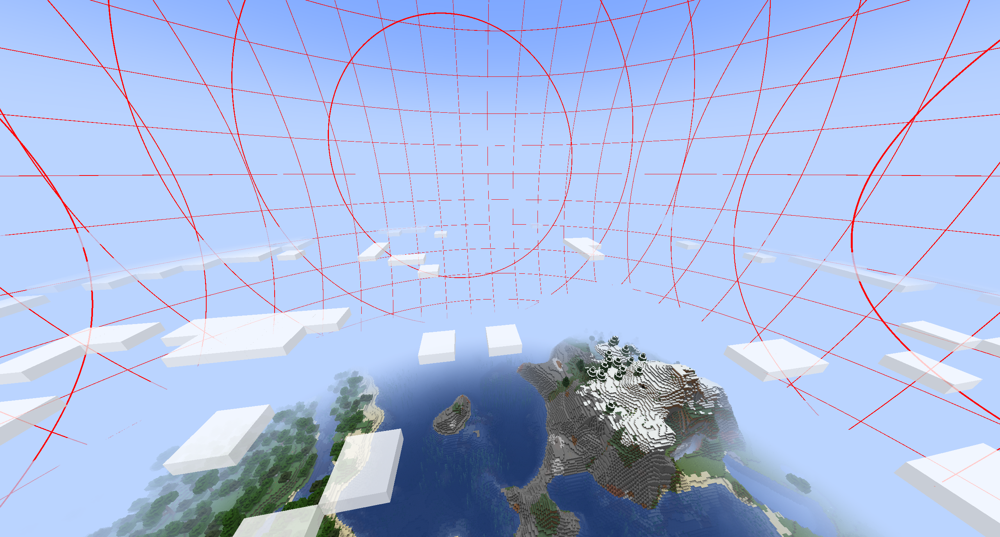
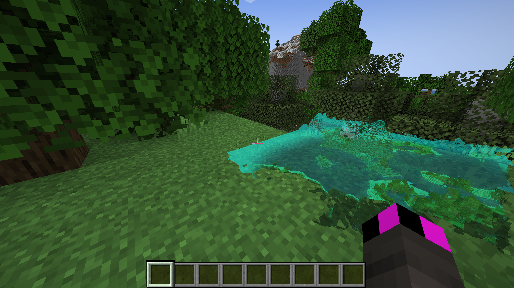
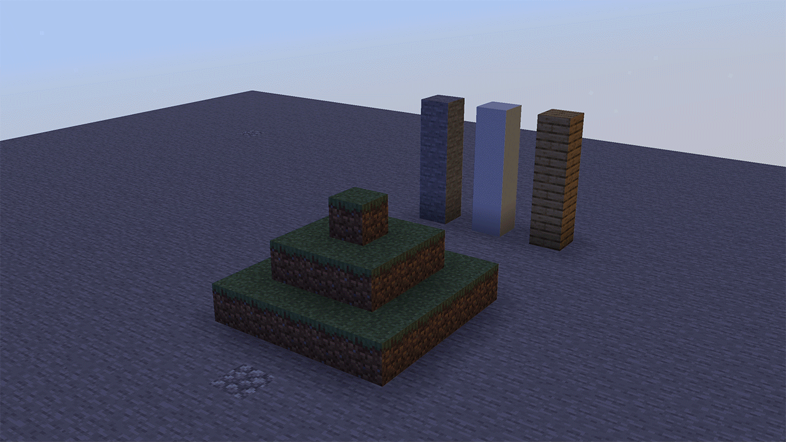
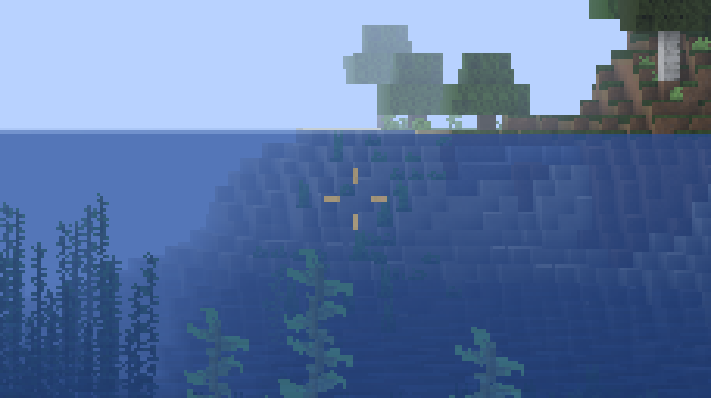

# shader-toolkit
useful MC 1.17 vanilla shader examples

## extended-sky
Modifies vanilla sky so that it can be drawn below the horizon. Allows drawing of all of the sky. Also minimally affects the default sky. Horizon fog changes a bit. This is good for full custom skyboxes.

Requirements:
- none
 

## holo-minimap
!!!PROOF OF CONCEPT!!! WILL BREAK IN MANY SCENARIOS (to keep the shader simple).
Exemplifies rendering the scene twice (in an arguably cool way). Creates a second 3D hologram of terrain around the player in lower right of screen. Pseudo-random selection of frames to choose between renders.

Requirements:
- Fabulous
 

## sun-position
Exemplifies extracting sun position, ProjMat, ModelViewMat from core and passing into post. Computes directional lighting based on sun position and tod.

Requirements:
- Fabulous
 

## vaporwave
A E S T H E T I C. Couple neat tricks here. Bloom shader, waving water. Detecting water by using model height instead of texture. Barycentric coordinates to tell where on a face a fragment is. Also making use of extended sky. Does not include entities to keep the pack simple.

Requirements:
- none for base
- Fabulous for bloom
 

## vaporwave-solid
A E S T H E T I C. Solid version for those who actually want to play with this on. My question: WHY!?

Requirements:
- none for base
- Fabulous for bloom
 

## faster-fabulous
Tweak transparency shader for a small performance boost, especially on weaker systems. Up to 10% fps boost on UHD 630.

Requirements:
- Fabulous duh

## center-crosshair
MC-157252 (and it's predecessor MC-5024) has plagued MC for ages. With core shaders, it is now possible to fix it! Forget waiting for Mojang! Main concept is to calculate center of screen from within the shader and reposition the crosshair sprite (!!!Note that crosshair sprite width is even so be careful when creating your crosshairs!!!). 

Requirements:
- none
 